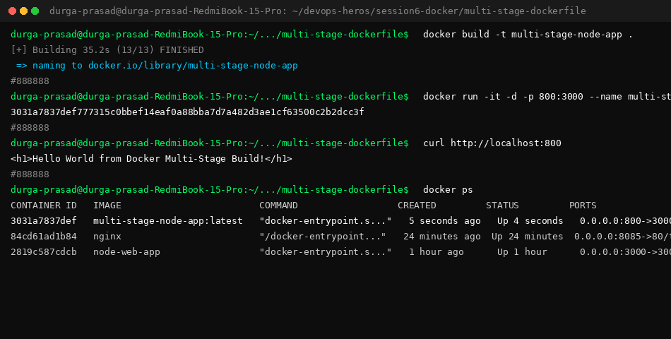

# Multi-Stage Dockerfile & Container Running Guide

**Name:** Durga Prasad
**Enrollment Number:** 10012

This guide documents the building, running, testing, and process inspection (`docker ps`) of the **Multi-Stage Node.js Application**.

---

## Terminal Execution & `docker ps` Screenshot



---

## 1. Multi-Stage `Dockerfile` Explanation

Multi-stage builds separate the **build stage** (compiling code, installing dev dependencies) from the **production stage** (lightweight runtime with minimal size).

```dockerfile
# -------------------------
# Stage 1: Build Stage
# -------------------------
FROM node:24-alpine AS builder

WORKDIR /app

COPY package*.json ./
RUN npm install

COPY . .

# -------------------------
# Stage 2: Production Stage
# -------------------------
FROM node:24-alpine AS production

WORKDIR /app

COPY --from=builder /app/package*.json ./
RUN npm install --omit=dev

COPY --from=builder /app/server.js ./

EXPOSE 3000

CMD ["npm", "start"]
```

---

## 2. Build & Execution Commands

### Step 1: Build the Multi-Stage Image
```bash
docker build -t multi-stage-node-app .
```

### Step 2: Run the Application Container
```bash
docker run -it -d -p 8080:3000 --name multi-stage multi-stage-node-app:latest
```

---

## 3. Verification & Endpoint Testing (`curl`)

Test the application running on host port `8080`:

```bash
$ curl http://localhost:8080
<h1>Hello World from Docker Multi-Stage Build!</h1>
```

---

## 4. Running Process Inspection (`docker ps`)

```bash
$ docker ps --filter "name=multi-stage"

CONTAINER ID   IMAGE                  COMMAND                  CREATED          STATUS          PORTS                                         NAMES
b8abbd751f81   multi-stage-node-app   "docker-entrypoint.s…"   11 seconds ago   Up 10 seconds   0.0.0.0:8080->3000/tcp, [::]:8080->3000/tcp   multi-stage
```
